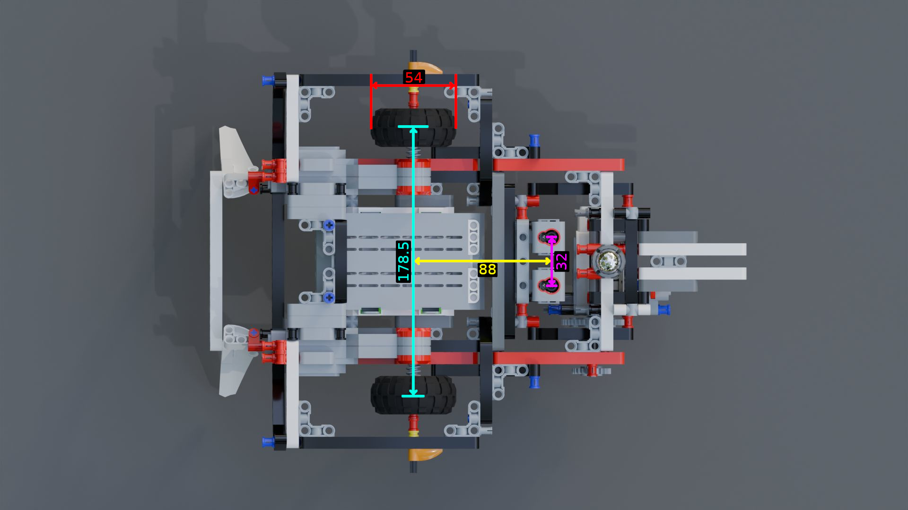
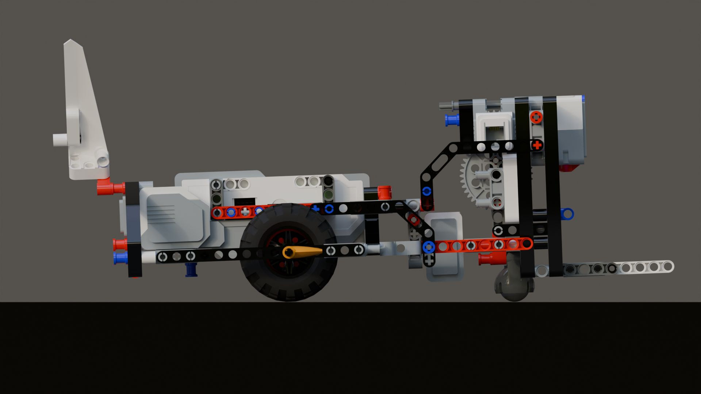
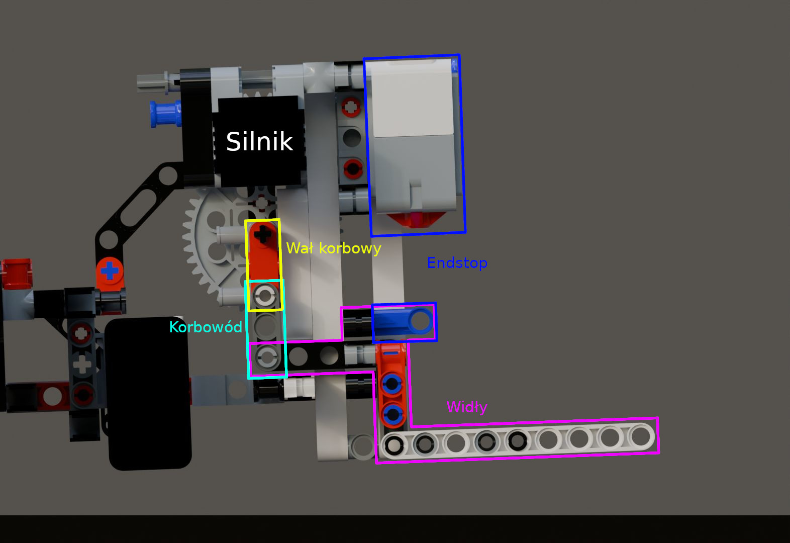

# Wstęp do Robotyki dla Informatyków - Sirius Mini

[Link do repozytorium](https://github.com/Mewash1/wri/tree/main)

# Autorzy

-   Adam Jeliński
-   Miłosz Mizak

# 1. Wstęp

Poniższa dokumentacja opisuje działanie kodu sterującego naszym robotem - Siriusem Mini. Robot został złożony z części zestawu LEGO Mindstorms.

Aby uruchomić robota, należy załadować do niego dwa pliki - `follower.py` oraz `transporter.py`. Po uruchomieniu dowolnego z nich należy poczekać na sygnał dźwiękowy, a następnie wpisać komendę `start`, aby robot rozpoczął działanie.

# 2. Ogólny opis działania

Robot miał za cel wykonać dwa zadania. Pierwszym było **Follow The Line**, które polegało na dokładnym śledzeniu czarnej linii, tworzącej trasę dla robota. Trasa zawiera w sobie pętle a także skrzyżowania, które należało przejeżdżać na wprost.

Drugim zadaniem był **Transporter**. Robot po rozpoznaniu kolorowego skrzyżowania musiał wjechać w to skrzyżowanie, podnieść paczkę, wycofać się do skrzyżowania, dotrzeć do drugiego skrzyżowania i na drugim kolorowym polu zostawić tę paczkę.

Aby mieć możliwość wykonania tych zadań, robot został wyposażony w dwa kluczowe elementy. Pierwszym były **czujniki kolorów**, które są mu potrzebne do decyzji o skręcaniu w odpowiednim momencie.

Drugim był **podnośnik**, analogiczny do takiego w wózku widłowym. Widły wchodzą w dziurę w dolnej części przesyłki, a następnie podnoszą się. W górnej części wideł zamontowany jest **czujnik dotyku**. Gdy widły podniosą się wystarczająco wysoko, wciskają czujnik, co zatrzymuje ich dalsze wznoszenie.

Oczywiście mechanizm podnoszenia i opuszczania wideł jest sterowany przez program.

# 3. Opis fizycznej konstrukcji

W celu lepszego zaplanowania robota, stworzyliśmy dokładną replikę naszego robota w programie Bricklink Studio 2.0. Dzięki temu mogliśmy myśleć nad rozwiązaniami poza zajęciami i mieliśmy możliwość stworzenia ładnych renderów do tej dokumentacji. Model znajduje się w pliku `sirius_mini.io`.

## Baza jezdna

Na samym początku budowania naszego robota postanowiliśmy, że najprościej będzie sterować robotem z napędem różnicowym i metalową kulą służącą jako podparcie. Dzięki temu mamy możliwość bardzo łatwego skręcania w miejscu i możemy skorzystać z gotowego kontrolera `MoveDifferential` z biblioteki `ev3dev2`.

Staraliśmy się wybrać jak najmniejsze kółka oraz jak największy ich rozstaw, aby maksymalnie wykorzystać rozdzielczość enkoderów z kół. Dodatkowo każdy element konstrukcji jest bardzo sztywny, dzięki czemu minimalizowaliśmy niepewność związaną z wyginaniem się robota. Dlatego koła nie trzymają się jedynie na silnikach, ale mają dodatkowe podparcia od zewnątrz.

Wymiary:

- średnica kółek: 54mm
- rozstaw kółek: 178.5mm
- odległość pomiędzy czujnikami i osią: 88mm
- rozstaw między czujnikami: 32mm

## Czujniki

Czujniki koloru umieściliśmy względnie blisko osi obrotu robota, dzięki czemu robot niezbyt często wchodził w oscylacje podczas szukania linii. Zamontowane są na tyle nisko, że linia może w całości zmieścić się między ich polami pomiarowymi.

## Transporter

Aby przenieść paczkę, postanowiliśmy że stworzymy mechanizm z widłami, które poruszają się w pionie. Rozwiązanie to jest znacznie bardziej skomplikowane niż typowy hak, który był wykorzystany przez konkurencję. My uznaliśmy, że będzie to ciekawe wyzwanie i stworzenie wózka widłowego będzie zabawne.

W celu osiągnięcia pionowego ruchu wideł konieczna była zamiana ruchu obrotowego z silnika na ruch posuwisty. Musieliśmy bardzo kreatywnie podejść do problemu aby to osiągnąć z dostępnymi elementami. Ostatecznie stworzyliśmy mechanizm korbowy, z pionową prowadnicą, utrzymującą widły w poziomie.

Aby nie musieć ręcznie kalibrować pozycji wideł przy każdym uruchomieniu, używamy czujnika dotyku jako endstop. Podczas startu programu robot podnosi widły aż o niego uderzy, dzięki czemu zawsze wie gdzie się znajdują.

Dzięki lekkiemu skosowi robota, paczka jest oparta o tył wideł i nie zsuwa się podczas jazdy.

## Ciekawostki

Najważniejszym elementem konstrukcyjnym jest spoiler z tyłu robota, daje on nam maksymalną liczbę punktów za styl.

Ze względu na duże zużycie najpopularniejszych elementów, nasz robot nie zawiera prawie żadnych czarnych podwójnych pinów. Zamiast nich korzystaliśmy z potrójnych pinów z zatyczką, tam gdzie to było możliwe. To znacząco poprawiło stabilność naszej konstrukcji.

# 4. Opis działania programu

Zarówno `transporter` jak i `follower` działają na tym samym kodzie, z tą różnicą, że `follower` jest okrojony z części przeznaczonej do transportu paczek. Wobec tego omówimy tutaj jedynie kod `transporter.py`.

Aby móc komunikować się z częściami podłączonymi do kostki EV3, wykorzystywana jest biblioteka `ev3dev2`. Biblioteka dostarcza obiektowe odpowiedniki elementów robota - czujniki, silniki, wejścia i wyjścia.

Robot działa na zasadzie poniższej maszyny stanowej:

Oczywiście w zadaniu **Follow The Line** używany jest jedynie stan **Following**.

## Klasy

### PID

Klasa implementująca regulator proporcjonalno-całkująco-różniczkujący. Na podstawie wartości regulatora robot wylicza w jakim kierunku powinien jechać. Regulator zawiera prostą metodę _reset_ do resetu wartości czynnika całkującego oraz poprzedniej wartości błędu. Metoda _step_ wylicza sterowanie na podstawie błędu między wyliczoną pozycją a tą rzeczywistą.

### Kolo

Bardzo prosta klasa dziedzicząca po klasie _Wheel_. Jej jedynym zadaniem jest tworzenie za każdym razem takiego obiektu klasy _Wheel_, który będzie pasował do kół zamontowanych w naszym robocie. Klasa ta jest wykorzystywana do inicjalizacji kontrolera napędu różnicowego.

### Vehicle

Klasa opisująca całego robota.

#### Parametry

-   `wheel_separation`- rozstaw kół
-   `sensor_offset` - odległość między czujnikami koloru a środkiem robota
-   `speed` - obecna prędkość robota
-   `default_speed` - bazowa prędkość robota
-   `forklift_motor` - uchwyt do silnika do wideł
-   `forklift_sensor` - uchwyt do czujnika dotyku do wideł
-   `color_sensor_right` - uchwyt do prawego czujnika koloru
-   `color_sensor_left` - uchwyt do lewego czujnika koloru
-   `controller` - uchwyt do kontrolera napędu różnicowego
-   `sound` - komponent dźwiękowy

W konstruktorze klasy są także ustawiane maksymalne wartości czujników koloru. Jest to element kalibracji robota, więc wartości które są tam wpisane różnić się będą w zależności od konkretnych czujników.

Jako kontroler napędu używamy klasy `MoveDifferential` dostępną w bibliotece `ev3dev2`. Dzięki temu możemy w bardzo prosty sposób sterować robotem, bez martwienia się niskopoziomowe obsługiwanie silników. 

#### Metody

-   `set_state` - ustawia nowy stan robota
-   `sense_line` - zwraca różnicę między natężeniem światła prawego i lewego czujnika (a także wartości tych natężeń)
-   `set_speed` - ustala prędkość obu silników na podstawie zadanego sterowania
-   `sense_colour` - sprawdza kolor znajdujący się pod czujnikami i zwraca miarę "kolorowości" danego miejsca. Aby ją wyznaczyć obliczamy różnicę między składową czerwoną a średnią ze składowej zielonej i niebieskiej. Dzięki temu miara da zwraca duże wartości dla zielonego i niebieskiego, a niskie dla białego i czarnego
-   `run` - główna pętla działania robota. Robot zostaje ustawiony w stan Following, czyszczony jest ekran terminala, a następnie robot gra dźwięk oznaczający, że jest gotowy do działania. Potem zerowana jest odometria, a widły zostają zresetowane. W pętli robot wykonuje tylko jedną czynność - wywołuje metodę `step` na obecnym stanie.

### LineFollower

Klasa ta jest najprostszą implementacją line followera, którą później wykorzystujemy w niektórych stanach programu. 

Do metody `step` przyjmuje różnicę jasności między prawym i lewym czujnikiem koloru. Różnica ta jest przekazywana do sterownika PID, który dąży do zerowania tej wartości (ustawienia robota równo na linii). Wyjście ze sterownika jest ograniczane do przedziału `-100 -- 100` a następnie przekazywane jako wejście do sterowania dla kontrolera napędu.

Dzięki temu podejściu jesteśmy w stanie bez problemów podążać po linii bez żadnej dodatkowej logiki.

### State

Klasa bazowa dla wszystkich stanów. Jej jedynym polem jest `context`, którym jest instancja klasy `Vehicle`. Klasa ma dwie metody: `setup` i `step`. Ta pierwsza drukuje wiadomość do terminala o zmianie stanu oraz ustala różne zmienne lokalne. Ta druga jest wykonywana w pętli przez `Vehicle`.

### StateIdle

Instancja tego stanu powoduje zakończenie programu.

### StateFollowing

W tym stanie robot porusza się po linii. Jeżeli w trakcie poruszania się wykryje zmianę w kolorze (bo na przykład dojechał do zakrętu), to wchodzi w tryb powolnego ruchu z dwa razy mniejszą prędkością. Dzięki temu prościej jest mu wykryć dokładną wartość koloru. Jeżeli faktycznie okaże się, że robot dojechał do skrzyżowania o konkretnym kolorze, to robot przechodzi do stanu **EnterBranch**.

Nasz sposób mierzenia koloru sprawia, że robot jest w stanie wykryć dowolny kolor, o ile posiada odpowiednie czujniki. Nasze konkretne czujniki najlepiej radziły sobie z wykrywaniem koloru zielonego i niebieskiego, więc to na takich kolorach przeprowadzaliśmy testy.

### StateEnterBranch

Robot powoli skręca wchodząc w kolorowe skrzyżowanie. Gdy uda mu się wyprostować, wchodzi w stan **SearchTarget**.

### StateSearchTarget

Ten stan faktycznie szuka celu, z tym że celem nie jest sama paczka, a kafelek określonego koloru na którym leży. W związku z tym stan jest wykorzystywany dwa razy - pierwszy raz przed podniesieniem paczki i drugi raz przed jej odstawieniem na miejsce.

Jako, że w trakcie uruchomienia tego stanu czujniki mogą dalej znajdować się przy kolorowym skrzyżowaniu, to robot mógłby omyłkowo stwierdzić, że natychmiast odnalazł swój cel. Aby temu zapobiec, blokujemy możliwość wykrycia celu przez określony czas.

Robot przechodzi następnie w stan **PickupPackage** lub w stan **DropPackage**, w zależności od tego czy trzyma paczkę.

### StatePickupPackage

Robot zatrzymuje się, podnosi widły (miejmy nadzieję że razem z paczką), a następnie przechodzi do stanu **ReturnToLine**.

### StateReturnToLine

Robot przejeżdża trochę do przodu, a następnie obraca się o 180 stopni i przechodzi do stanu **ReturnToIntersection**.

### StateReturnToIntersection

Robot jedzie tak długo, aż ponownie nie natrafi na kolorowe skrzyżowanie, po czym przechodzi do stanu **ExitIntersection**.

### StateExitIntersection

Robot jedzie tak, aby jego środek znajdował się na środku skrzyżowania. Następnie robi zwrot o 90 stopni i ponownie przechodzi do stanu **Following**. Będąc w tym stanie będzie teraz znów szukał kolejnego skrzyżowania, aby tam wjechać i zostawić paczkę.

### StateDropPackage

Robot przejeżdża odrobinę do przodu i zostawia paczkę. Następnie przechodzi do stanu **Finish**.

### StateFinish

Robot cofa się, obraca się o 180 stopni a następnie wydaje okrzyk zwycięstwa i wesoło porusza widłami w górę i w dół.

# 5. Kalibracja

## System napędowy

Aby zmaksymalizować dokładność pracy naszego robota przeprowadziliśmy kompleksową kalibrację rozmiaru kółek oraz rozstawu osi. 

Do kalibracji rozmiaru kół początkowo użyliśmy wymiarów od LEGO. Następnie kazaliśmy robotowi przejechać 2 metry i zmierzyliśmy faktyczny dystans. Następnie zaktualizowaliśmy średnicę kół zgodnie z proporcją którą uzyskaliśmy i powtórzyliśmy test. Po uzyskaniu zadowalająco niskiego błędu zakończyliśmy kalibrację.

Do kalibracji rozstawu kół zaczęliśmy od zmierzenia jego przybliżonej wartości suwmiarką. Następnie kazaliśmy robotowi zrobić obrót o 180 stopni i patrzeliśmy czy obróci się za dużo, czy za mało. Następnie metodą przeszukiwania binarnego ustaliliśmy zadowalającą wartość rozstawu kół.

Niestety nie mogliśmy skalibrować różnicy średnicy prawego i lewego koła, ponieważ wymagałoby to przepisanie całej logiki `MoveDifferential`. W związku z tym próbowaliśmy różne pary kółek dostępnych w laboratorium, aby znaleźć parę, która nie będzie zbyt znacząco znosić na boki.

## Czujniki

Do kalibracji czujników początkowo użyliśmy gotowej funkcji do ustawiania odpowiednich wartości maksymalnych dla białej płytki. Było to uciążliwe, bo wymagało kalibracji przed każdym startem. Dlatego dokonaliśmy ręcznej kalibracji i samodzielnie podajemy wartości dla `red_max` `green_max` i `blue_max` dla obu czujników.

## PID

Nastawy dla sterownika PID wybraliśmy eksperymentalnie, przy użyciu osobnego programu do szybkich testów różnych nastawów.

# 6. Napotkane problemy

## Czujniki

Jakość danych zwracanych przez dostępne czujniki koloru jest bardzo niska. Nawet po kalibracji koloru białego, pomiary często były niestabilne i dalekie od tego czego byśmy oczekiwali. Dodatkowo, sposób pomiaru wykorzystany przez te czujniki powoduje, że jeżeli robot się porusza, to każda składowa może być zmierzona w innej pozycji. To powodowało, że czasami czarny był rozpoznawany jako niebieski i ostry zakręt wyglądał jak niebieskie skrzyżowanie.

## Micropython

Aby przyśpieszyć proces prototypownia, często korzystaliśmy z interpretera micropython zamiast standardowego pythona, aby oszczędzić wiele cennych sekund na każdy start programu. Niestety micropython ma problemy z funkcjami które są blokujące, np obrót silnikiem o określony dystans i czasami losowo wyrzuca błąd. Z tego powodu podczas ostatnich laboratoriów byliśmy zmuszeni skorzystać z wolniejszego pythona, aby mieć pewność, że nie stracimy finałowego testu z powodu losowego crasha programu.
