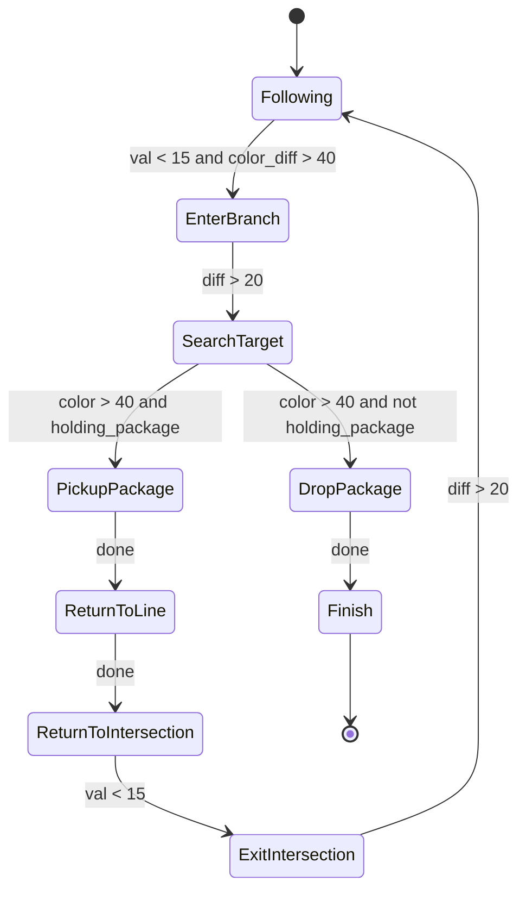

# Autorzy

## Adam Jeliński
## Miłosz Mizak

# 1. Wstęp

Poniższa dokumentacja opisuje działanie kodu sterującego naszym robotem - Siriusem Mini. Robot został złożony z części zestawu LEGO Mindstorms, a instrukcja jego złożenia jest dostępna w odrębnym pliku.

Aby uruchomić robota, należy załadować do niego dwa pliki - `follower.py` oraz `transporter.py`. Po uruchomieniu dowolnego z nich należy poczekać na sygnał dźwiękowy, a następnie wpisać komendę `start`, aby robot rozpoczął działanie.

# 2. Ogólny opis działania

Robot miał za cel wykonać dwa zadania. Pierwszym było **Follow The Line**, które polegało na dokładnym śledzeniu czarnej linii, tworzącej trasę dla robota. Trasa zawiera w sobie pętle a także skrzyżowania, które należało przejeżdżać na wprost.

Drugim zadaniem był **Transporter**. Robot po rozpoznaniu kolorowego skrzyżowania musiał wjechać w to skrzyżowanie, podnieść paczkę, wycofać się do skrzyżowania, dotrzeć do drugiego skrzyżowania i na drugim kolorowym polu zostawić tę paczkę. 

Aby mieć możliwość wykonania tych zadań, robot został wyposażony w dwa kluczowe elementy. Pierwszym były **czujniki kolorów**, które są mu potrzebne do decyzji o skręcaniu w odpowiednim momencie. 

Drugim był **podnośnik**, analogiczny do takiego w wózku widłowym. Widły wchodzą w dziurę w dolnej części przesyłki, a następnie podnoszą się. W górnej części wideł zamontowany jest **czujnik dotyku**. Gdy widły podniosą się wystarczająco wysoko, wciskają czujnik, co zatrzymuje ich dalsze wznoszenie.

Oczywiście mechanizm podnoszenia i opuszczania wideł jest sterowany przez program.

# 3. Opis działania programu

Zarówno `transporter` jak i `follower` działają na tym samym kodzie, z tą różnicą, że `follower` jest okrojony z części przeznaczonej do transportu paczek. Wobec tego omówimy tutaj jedynie kod `transporter.py`.

Aby móc komunikować się z częściami podłączonymi do kostki EV3, wykorzystywana jest biblioteka `ev3dev2`. Biblioteka dostarcza obiektowe odpowiedniki elementów robota - czujniki, silniki, wejścia i wyjścia. 

Robot działa na zasadzie poniższej maszyny stanowej: 

Oczywiście w **Follow The Line** używany jest jedynie stan **Following**.

## Klasy

### PID

Klasa implementująca regulator proporcjonalno-całkująco-różniczkujący. Na podstawie wartości regulatora robot wylicza w jakim kierunku powinien jechać. Regulator zawiera prostą metodę *reset* do resetu wartości czynnika całkującego oraz poprzedniej wartości błędu. Metoda *step* wylicza sterowanie na podstawie błędu między wyliczoną pozycją a tą rzeczywistą.

### Kolo

Bardzo prosta klasa dziedzicząca po klasie *Wheel*. Jej jedynym zadaniem jest tworzenie za każdym razem takiego obiektu klasy *Wheel*, który będzie pasował do kół zamontowanych w naszym robocie.

### Vehicle

Klasa opisująca całego robota. 

#### Parametry
- `wheel_separation`- rozstaw kół
- `sensor_offset` - odległość między czujnikami koloru a środkiem robota
- `speed` - obecna prędkość robota
- `default_speed` - bazowa prędkość robota
- `forklift_motor` - uchwyt do silnika do wideł
- `forklift_sensor` - uchwyt do czujnika dotyku do wideł
- `color_sensor_right` - uchwyt do prawego czujnika koloru
- `color_sensor_left` - uchwyt do lewego czujnika koloru
- `controller` - uchwyt do kontrolera
- `sound` - komponent dźwiękowy

W konstruktorze klasy są także ustawiane maksymalne wartości czujników koloru. Jest to element kalibracji robota, więc wartości które są tam wpisane różnić się będą w zależności od konkretnych czujników.

#### Metody

- `set_state` - ustawia nowy stan robota
- `sense_line` - zwraca różnicę między natężeniem światła prawego i lewego czujnika (a także wartości tych natężeń)
- `set_speed` - ustala prędkość obu silników na podstawie zadanego sterowania
- `run` - główna pętla działania robota. Robot zostaje ustawiony w stan Following, czyszczony jest ekran terminala, a następnie robot gra dźwięk oznaczający, że jest gotowy do działania. Potem zerowana jest odometria, a widły zostają zresetowane. W pętli robot wykonuje tylko jedną czynność - wywołuje metodę `step` na obecnym stanie.

### LineFollower

Klasa obsługuje PID - przekazuje jego wyliczenia do `Vehicle`.

### State

Klasa bazowa dla wszystkich stanów. Jej jedynym polem jest `context`, którym jest instancja klasy `Vehicle`. Klasa ma dwie metody: `setup` i `step`. Ta pierwsza drukuje wiadomość do terminala o zmianie stanu oraz ustala różne zmienne lokalne. Ta druga jest wykonywana w pętli przez `Vehicle`.

### StateIdle

Instancja tego stanu powoduje zakończenie programu.

### StateFollowing

W tym stanie robot porusza się po linii. Jeżeli w trakcie poruszania się wykryje zmianę w kolorze (bo na przykład dojechał do zakrętu), to wchodzi w tryb powolnego ruchu z dwa razy mniejszą prędkością. Dzięki temu prościej jest mu wykryć dokładną wartość koloru. Jeżeli faktycznie okaże się, że robot dojechał do skrzyżowania o konkretnym kolorze, to robot przechodzi do stanu **EnterBranch**.

Dwie uwagi:
- nasz sposób mierzenia koloru sprawia, że robot jest w stanie wykryć dowolny kolor, o ile posiada odpowiednie czujniki. Nasze konkretne czujniki najlepiej radziły sobie z wykrywaniem koloru zielonego i niebieskiego, więc to na takich kolorach przeprowadzaliśmy testy.
- tick_limit (nie wiem w sumie do końca po co nam to było, dopiszesz? XD)

### StateEnterBranch

Robot powoli skręca wchodząc w kolorowe skrzyżowanie. Gdy uda mu się wyprostować, wchodzi w stan **SearchTarget**.

### StateSearchTarget

Ten stan faktycznie szuka celu, z tym że celem nie jest sama paczka, a kafelek określonego koloru na którym leży. W związku z tym stan jest wykorzystywany dwa razy - pierwszy raz przed podniesieniem paczki i drugi raz przed jej odstawieniem na miejsce. 

Jako, że w trakcie uruchomienia tego stanu czujniki mogą dalej znajdować się przy kolorowym skrzyżowaniu, to robot mógłby omyłkowo stwierdzić, że natychmiast odnalazł swój cel. Aby temu zapobiec, blokujemy możliwość wykrycia celu przez określony czas.

Robot przechodzi następnie w stan **PickupPackage** lub w stan **DropPackage**, w zależności od tego czy trzyma paczkę.

### StatePickupPackage

Robot zatrzymuje się, podnosi widły (miejmy nadzieję że razem z paczką), a następnie przechodzi do stanu **ReturnToLine**.

### StateReturnToLine

Robot przejeżdża trochę do przodu, a następnie obraca się o 180 stopni i przechodzi do stanu **ReturnToIntersection**.

### StateReturnToIntersection

Robot jedzie tak długo, aż ponownie nie natrafi na kolorowe skrzyżowanie, po czym przechodzi do stanu **ExitIntersection**.

### StateExitIntersection

Robot jedzie tak, aby jego środek znajdował się na środku skrzyżowania. Następnie robi zwrot o 90 stopni i ponownie przechodzi do stanu **Following**. Będąc w tym stanie będzie teraz znów szukał kolejnego skrzyżowania, aby tam wjechać i zostawić paczkę.

### StateDropPackage

Robot przejeżdża odrobinę do przodu i zostawia paczkę. Następnie przechodzi do stanu **Finish**.

### StateFinish

Robot cofa się, obraca się o 180 stopni a następnie wydaje okrzyk zwycięstwa i wesoło porusza widłami w górę i w dół.

